# React

<!-- TOC -->

- [React](#react)
  - [1.React入门](#1react入门)
    - [1.1虚拟DOM (Virtual DOM)](#11虚拟dom-virtual-dom)
    - [1.2 JSX](#12-jsx)
  - [2.React面向组件编程](#2react面向组件编程)
    - [2.1 组件](#21-组件)
  - [2.2 State & 生命周期](#22-state--生命周期)
  - [2.3 事件处理](#23-事件处理)
    - [2.3.1 向事件处理程序传递参数](#231-向事件处理程序传递参数)
  - [2.4 条件渲染](#24-条件渲染)
    - [2.4.1 元素变量](#241-元素变量)
    - [2.4.2 使用&&运算符](#242-使用运算符)
    - [2.4.3 使用三目运算符](#243-使用三目运算符)
    - [2.4.4 隐藏子组件](#244-隐藏子组件)
  - [3.应用](#3应用)

<!-- /TOC -->
## 1.React入门

### 1.1虚拟DOM (Virtual DOM)

1. 更新DOM代价高昂, 尽可能将变动放入虚拟DOM中批量进行输送, 大幅度减少DOM更新次数.
2. React Diff算法, 只进行虚拟DOM变动部分的更新.

React Diff:

    tree diff:
        1. 通过updateDepth进行节点的层级控制.
        2. 每个节点只与同级节点比较, 所以只需要对树结构的一次遍历, 如果节点不存在时, 删除该节点及其子节点.
        3. 当出现跨层级操作时, 只进行增删操作来完成, 官方建议尽量不要进行层级操作, 否则请使用CSS隐藏,显示等.
    component diff:
        1. 同一类型的两个组件，按原策略（层级比较）继续比较Virtual DOM树即可。
        2. 同一类型的两个组件，组件A变化为组件B时，可能Virtual DOM没有任何变化，如果知道这点（变换的过程中，Virtual DOM没有改变），可节省大量计算时间，所以用户 可以通过 shouldComponentUpdate() 来判断是否需要 判断计算。
        3. 不同类型的组件，将一个（将被改变的）组件判断为dirty component（脏组件），从而替换 整个组件的所有节点。
        注意：如果组件D和组件G的结构相似，但是 React判断是 不同类型的组件，则不会比较其结构，而是删除 组件D及其子节点，创建组件G及其子节点。
    element diff:
        当节点处于同一层级时，diff提供三种节点操作：删除、插入、移动。
        1. 插入：组件 C 不在集合（A,B）中，需要插入.
        2. 删除：
            （1）组件 D 在集合（A,B,D）中，但 D的节点已经更改，不能复用和更新，所以需要删除 旧的 D ，再创建新的。
            （2）组件 D 之前在 集合（A,B,D）中，但集合变成新的集合（A,B）了，D 就需要被删除。
        3. 移动：组件D已经在集合（A,B,C,D）里了，且集合更新时，D没有发生更新，只是位置改变，如新集合（A,D,B,C），D在第二个，无须像传统diff，让旧集合的第二个B和新集合的第二个D 比较，并且删除第二个位置的B，再在第二个位置插入D，而是 （对同一层级的同组子节点） 添加唯一key进行区分，移动即可。

### 1.2 JSX

[这个很重要:]<https://react.docschina.org/docs/jsx-in-depth.html#user-defined-components-must-be-capitalized>

## 2.React面向组件编程

### 2.1 组件

函数型组件:

    function Welcome(props) {
    return <h1>Hello, {props.name}</h1>;
    }

class型组件:

    class Welcome extends React.Component {
        render() {
            return <h1>Hello, {this.props.name}</h1>;
        }
    }

当React使用自定义组件时, 标签中的属性及其子组件可以传递给props.

    const element=<Mymy className='greeting'>Hello, world!</mymy>;

    // 注意：这是简化过的结构
    const element = {
        type: 'Mymy',
        props: {
            className: 'greeting',
            children: 'Hello, world!'
        }
    };

如上, 我们可以理解React元素的组成策略, 所以下面的代码可以在页面上渲染出"Hello 老徐真帅!"

    function Mymy(props){
        return <h1>Hello {props.name}</h1>
    }

    const element=<Mymy name='老徐真帅!'></mymy>;
    ReactDOM.render(
        element,
        document.getElementById('root');
    )

**注意: 需要使用大写作为自定义组件的首字母!**

## 2.2 State & 生命周期

我们需要遵守一项约定:

**不要在组件中进行props的修改, props应当是只读的.**

当我们需要进行数据的修改时, 可以使用state.

>组件的构造函数是唯一可以对 state 进行赋值的地方, 修改 state 使用 setState().

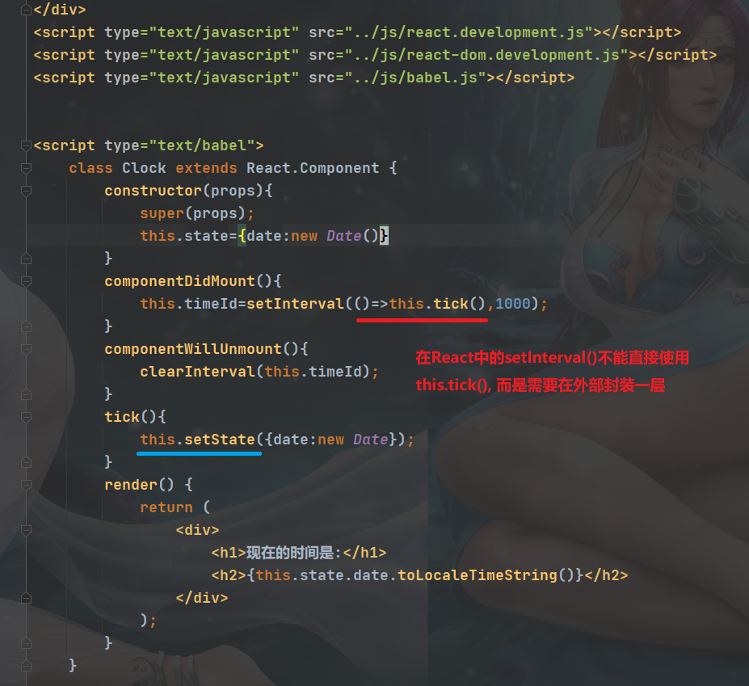
注意: 这里需要进行箭头函数的封装, 让this进行继承由上下文决定, this才会指向Clock组件. 否则由于this丢失, 在非严格模式下会指向window, 而window可没有setState方法.

>fn嵌套fn时, this会从内层向外层寻找, 寻找直接调用者, 丢失时直接指向window(非严格模式), 严格模式直接undifined.

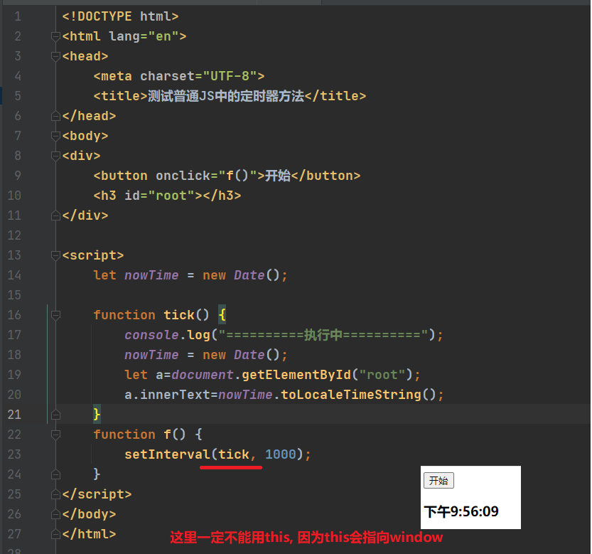

关于this的指向, 看下方的代码:
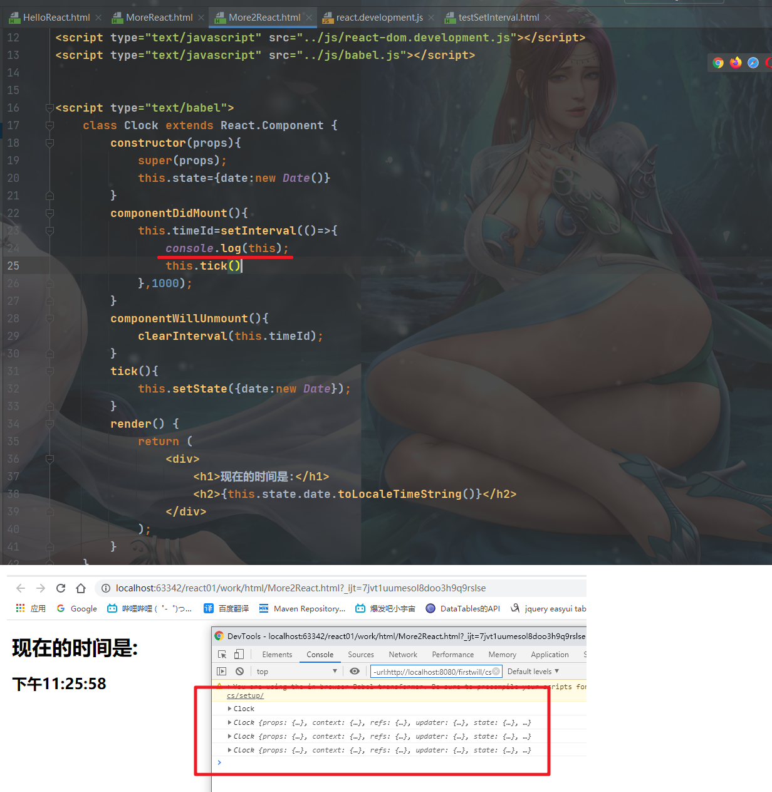

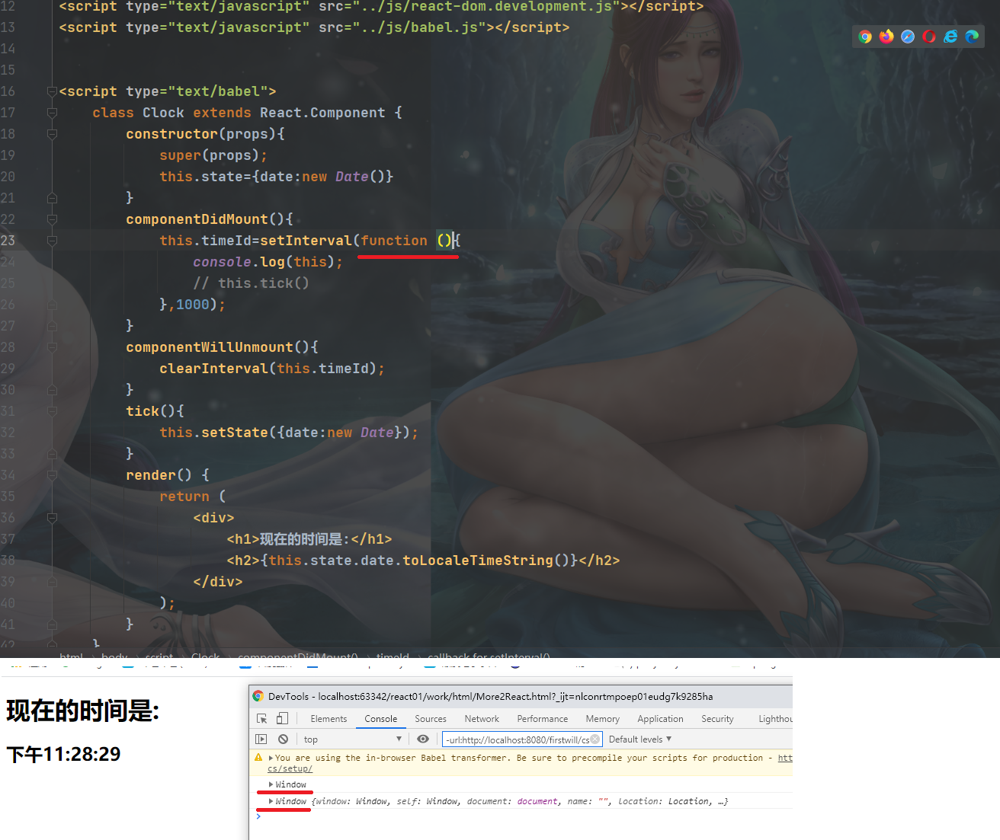
同理:
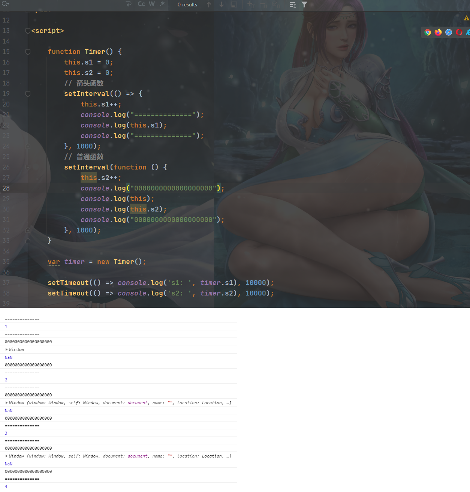

>箭头函数中的this, 是定义时决定, 而非运行时.

但是, 以下的例子比较有趣:  
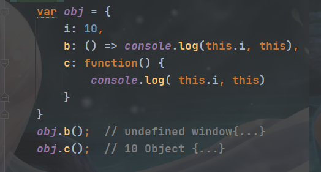  
当箭头函数不是嵌套于方法中时, 会指向window.

参考文档:  
[this的指向问题](../JS/this.md)

## 2.3 事件处理

- React 事件的命名采用小驼峰式（camelCase），而不是纯小写。
- 使用 JSX 语法时你需要传入一个函数作为事件处理函数，而不是一个字符串。
- 阻止页面元素的默认行为,需要使用专用的函数 `e.preventDefault();`

例如，传统的 HTML：

    <button onclick="activateLasers()">
      Activate Lasers
    </button>
在 React 中略微不同：

    <button onClick={activateLasers}>
      Activate Lasers
    </button>

你不能通过返回 false 的方式阻止默认行为。你必须显式的使用 preventDefault 。例如，传统的 HTML 中阻止链接默认打开一个新页面，你可以这样写：

    <a href="#" onclick="console.log('The link was clicked.'); return false">
      Click me
    </a>
在 React 中，可能是这样的：

    function ActionLink() {
      function handleClick(e) {
        e.preventDefault();
        console.log('The link was clicked.');
      }

      return (
        <a href="#" onClick={handleClick}>
          Click me
        </a>
      );
    }

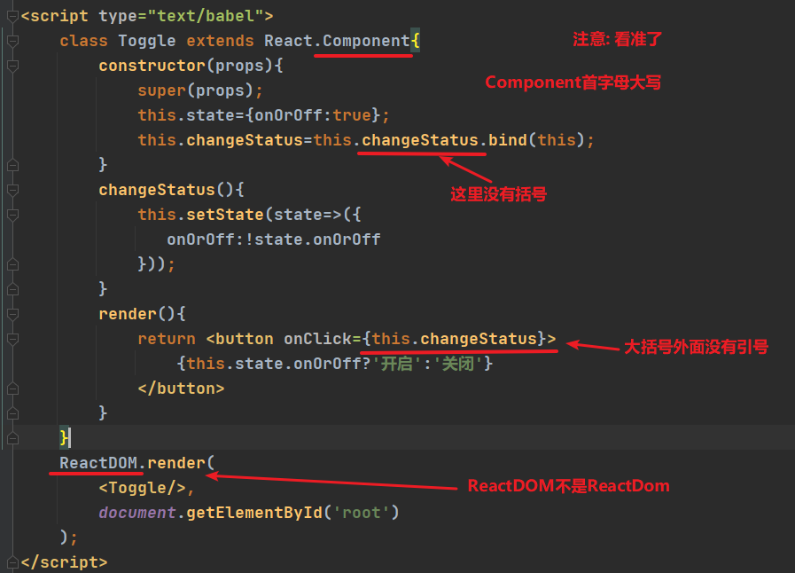

必须谨慎对待 JSX 回调函数中的 this，在 JavaScript 中，class 的方法默认不会绑定 this。如果你忘记绑定 this.handleClick 并把它传入了 onClick，当你调用这个函数的时候 this 的值为 undefined。

除了bind(), 还可以:  

    class LoggingButton extends React.Component {
      // 此语法确保 `handleClick` 内的 `this` 已被绑定。
      // 注意: 这是 *实验性* 语法。
      handleClick = () => {
        console.log('this is:', this);
      }

      render() {
        return (
          <button onClick={this.handleClick}>
            Click me
          </button>
        );
      }
    }

或者:  

    class LoggingButton extends React.Component {
      handleClick() {
        console.log('this is:', this);
      }

      render() {
        // 此语法确保 `handleClick` 内的 `this` 已被绑定。
        return (
          <button onClick={() => this.handleClick()}>
            Click me
          </button>
        );
      }
    }

### 2.3.1 向事件处理程序传递参数

在循环中，通常我们会为事件处理函数传递额外的参数。例如，若 id 是你要删除那一行的 ID，以下两种方式都可以向事件处理函数传递参数：

    <button onClick={(e) => this.deleteRow(id, e)}>Delete Row</button>
    <button onClick={this.deleteRow.bind(this, id)}>Delete Row</button>
上述两种方式是等价的，分别通过箭头函数和 Function.prototype.bind 来实现。

在这两种情况下，React 的事件对象 e 会被作为第二个参数传递。如果通过箭头函数的方式，事件对象必须显式的进行传递，而通过 bind 的方式，事件对象以及更多的参数将会被隐式的进行传递。

## 2.4 条件渲染

通过类似于 if 或者判断运算符来决定使用的组件.

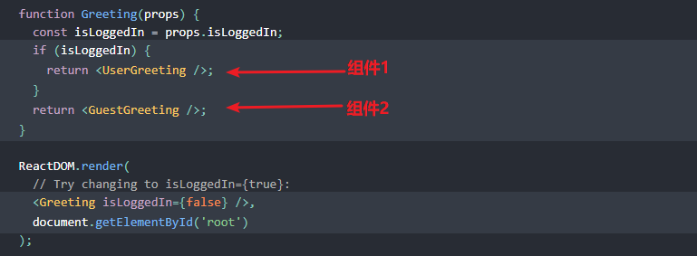

### 2.4.1 元素变量

将整个页面元素(组件)直接赋值给某个变量.
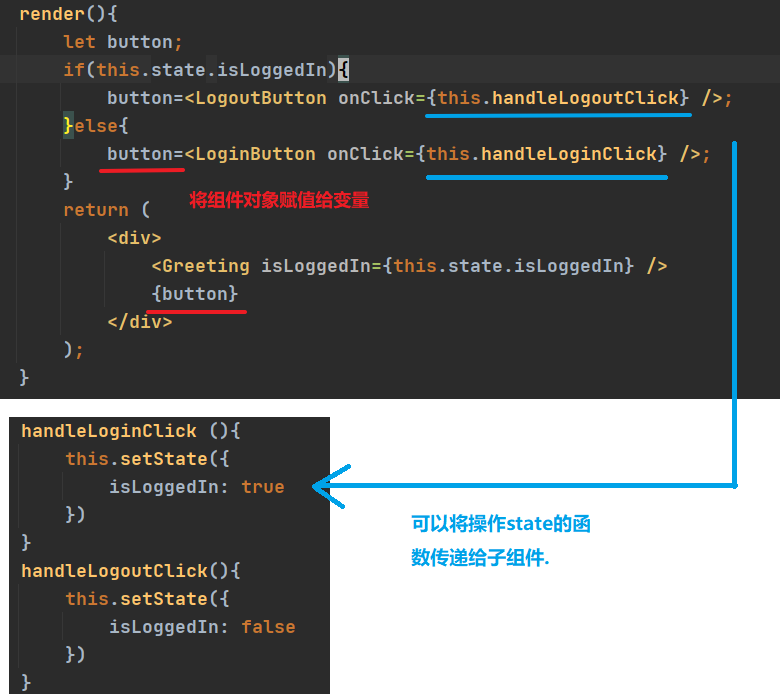

需要注意this代表的对象, 可能需要使用bind进行绑定..

### 2.4.2 使用&&运算符

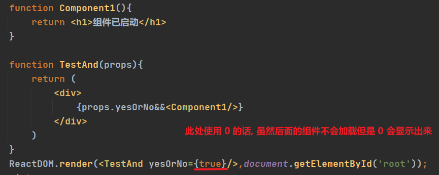

### 2.4.3 使用三目运算符

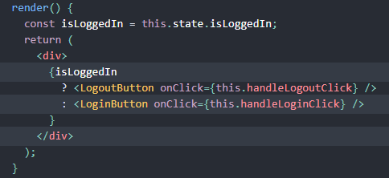

### 2.4.4 隐藏子组件

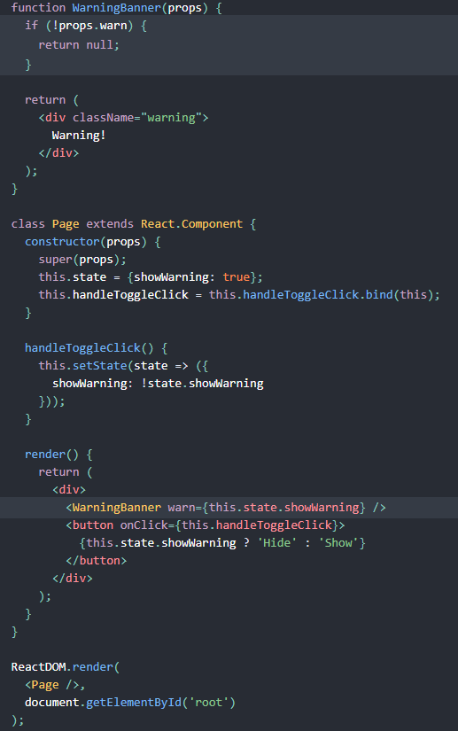

使用这种方式进行组件的隐藏, 是真的会导致编译后的html元素消失.

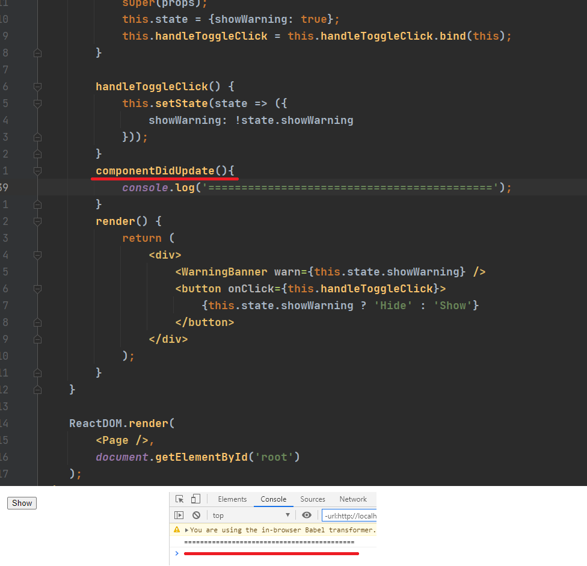

值得一提的是, 即使是render()返回null, 也不影响组件的生命周期. 即, 组件的生命周期函数是不会受影响的, 比如, 上面的例子, componentDidUpdate()是可以正常启动的.  

## 3.应用

