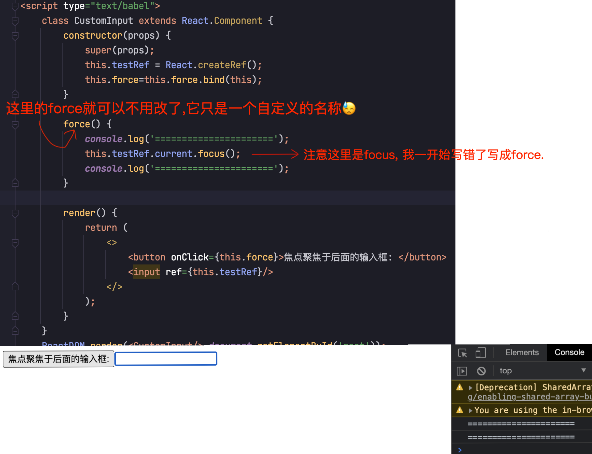
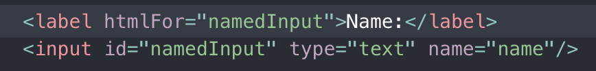
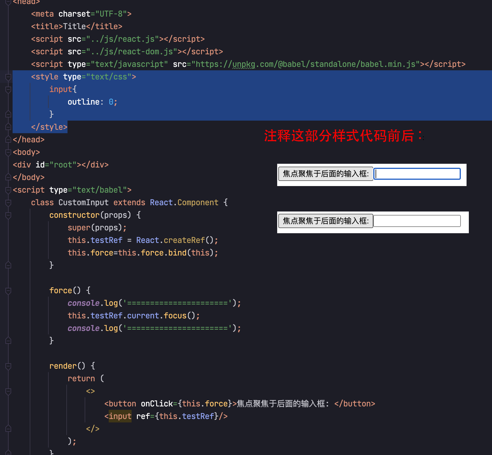

# React高级进阶

<!-- TOC -->

- [React高级进阶](#react高级进阶)
  - [1.render()返回数组](#1render返回数组)
  - [2.焦点控制](#2焦点控制)

<!-- /TOC -->

## 1.render()返回数组

React的render函数返回值需要是一个单独的html标签, 如果要返回并列的多个节点, 且实在不允许在外面再包一层时, 使用React.Fragment,`<React.Fragment></React.Fragment>` 或者使用它的简化式`<></>`

    render() {
        return (
            <React.Fragment>
            <ChildA />
            <ChildB />
            <ChildC />
            </React.Fragment>
        );
    }

简化:  

    class Columns extends React.Component {
        render() {
            return (
                <>
                    <td>Hello</td>
                    <td>World</td>
                </>
            );
        }
    }

## 2.焦点控制

使用React.createRef();创建一个引用型对象, 我们可以把这个对象绑定到一个html标签上, 然后通过focus()进行调用, 一旦运行该方法焦点立刻就会转移到绑定的组件上.

在h5中lable这样的标签有 for 可以可以绑定焦点， 在 React 中需要使用 htmlFor.

使用css 设置outline：0， 可以屏蔽焦点时的边框.

